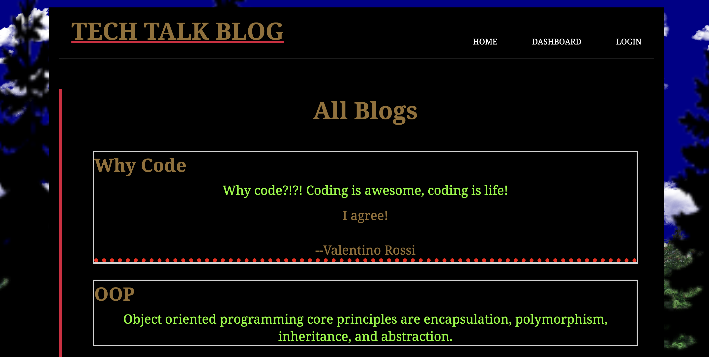
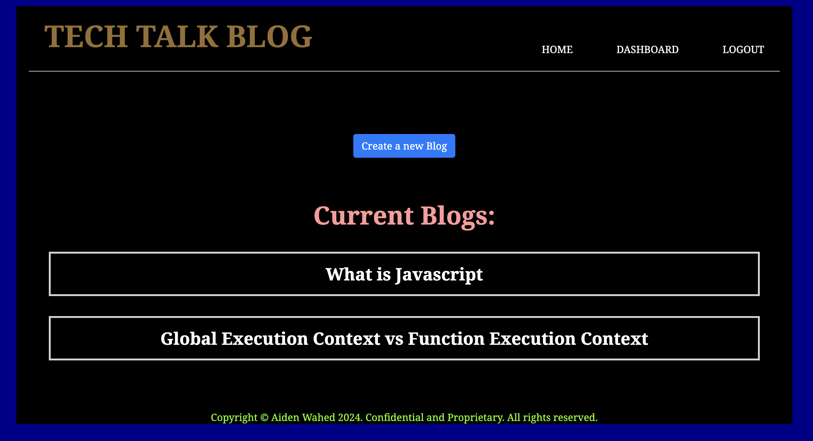
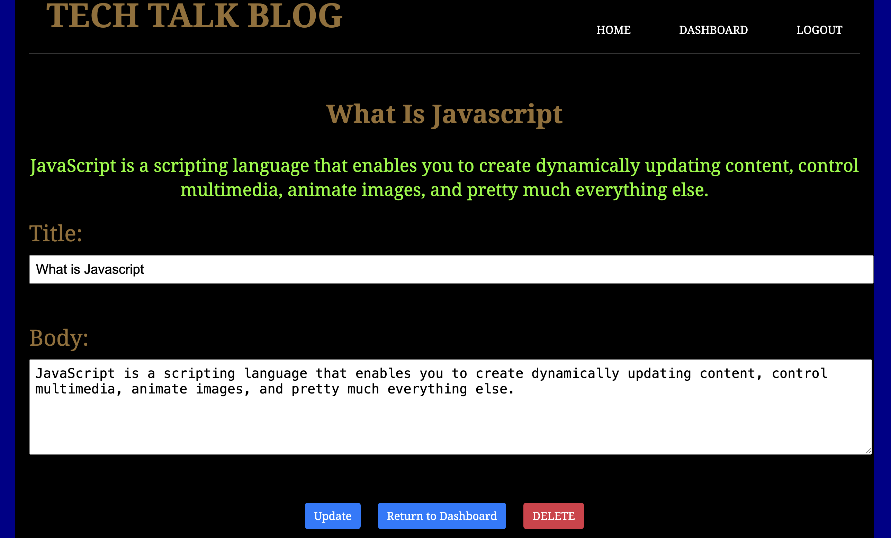

# Tech Talk Application

## Description:

The main goal of this project is to build a CMS-style blog site application from scratch following the MVC paradigm, where developers can publish their blog posts and comment on other developers’ posts as well. After completion of the project, I have a better understanding on building an entire full stack application with user authentication and third-party npm packages do improve the functionality and user experience. I also learned how to use route handlers effectively to access, and modify a database through http requests. And lastly I learned some better ways to access data through the DOM by using event delegation with the event target.

## Table of Contents:
- [Installation Instructions](#Installation-Instructions)
- [Usage Instructions](#Usage-Instructions)
- [Links](#Links)
- [Features](#Features)
- [Built With](#Built-With)
- [Test Instructions](#Test-Instructions)
- [License](#License)
- [Questions](#Questions)

## Installation Instructions:
Step 1: Clone repository.
 
Step 2: Install Nodejs.
 
Step 3: Install a source-code editor like VsCode.
 
Step 4: Nodemon is recommended in order to refresh and see updated notes data.

## Usage Instructions:
Step 1: In order to run the application locally, MySQL must be installed.
 
Step 2: Open VsCode(preferred) or another source-code editor if not already running.
 
Step 3: Open integrated terminal once in the main folder.
 
Step 4: "run npm i" / "sudo npm i" in the terminal to install the required dependencies.
 
Step 5: Source the Schema and Seeds files for the database by running "npm run seeds".
 
Step 6: Now to run the application, Enter "nodemon index.js" or "npm start" and "node server.js" if you don't have npm nodemon.
 
Step 7: After the "Tech Talk Listening on port..." appears in the console, open the local host URL that's displayed in the console.

## Links
Screenshots:

Heroku link:
[Heroku Link](https://git.heroku.com/tech-talk-blogger.git)

## Features:
Javascript variables, destructuring, classes and constructors, promises, try/catch methods, async/await methods, event delegation, etc.

## Built With:
- Dynamic JavaScript
- MVC (Model View Controller)
- Handlebars: as the main templating language.
- Express
- express-session: for user authentication.
- Sequelize: as the ORM (Object Relational Mapper).
- MySQL
- bcrypt
- License Badge: [Shields.io](https://shields.io/)
- Visual Studio Code: [Website](https://code.visualstudio.com/)

## Test Instructions:
For testing and debugging, the application logs requests and errors in the console. DBeaver, a client software application and a database administration tool, is also recommended to view the database and see it "visually."

## License:

Licensed under the The MIT License license.

  (https://opensource.org/licenses/MIT)

## Questions:
For additonal questions or concerns, feel free to contact me via [prismhead26@gmail.com](http://prismhead26@gmail.com). 
You can also find me on Github at [prismhead26](https://github.com/prismhead26).

© 2024 Aiden Wahed. All Rights Reserved.